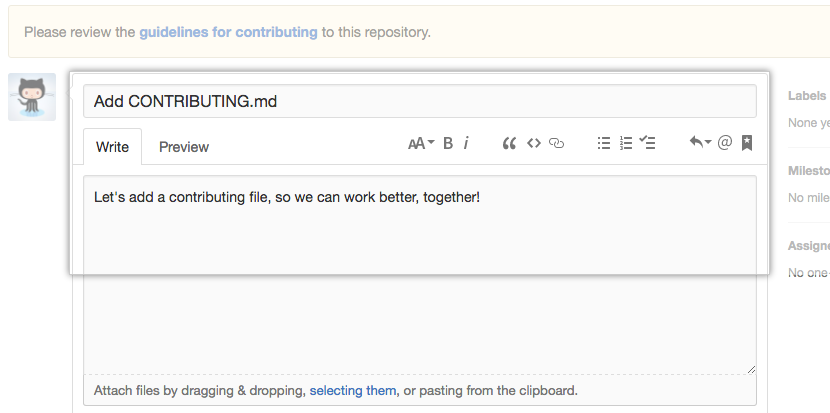

## Opening pull requests

The final step in making sure that your changes make it into the project is opening up a **pull request**. Pull requests compare your branch to the another branch of the repository, allow for your code to be reviewed and any necessary changes to be made, and handle branch merging automatically. The normal process of submitting code to the master branch via pull requests looks like this:
 1. You push your contributions to your personal branch
 2. You open up a pull request between your branch and the master branch
 3. You add reviewers to your code to check it before merging. Some projects, like the [Quantum Programming API](https://github.com/yaleqc/quantum-programming-api/) do this automatially.
 4. Reviewers either approve or request changes to your code.
 5. Once the code is approved, you merge your changes into the master branch!

#### To open up a pull request:

1. Open up the branch menu on the repository's home page and select your branch.

2. From the bar on top of the branch contents, click the Pull request button.

3. Looking at the dropdown menu, set the *base* branch to `master` and the *compare* branch to the branch that you made your changes in.

4. Add a title and description for your PR.

5. Select **Create Pull Request** (or draft if needed) and you're good to go!

###### Source: [GitHub Docs: Creating a pull request](https://docs.github.com/en/github/collaborating-with-issues-and-pull-requests/creating-a-pull-request)
  

[Next: Clean up your local repository](../part7-clean_up)